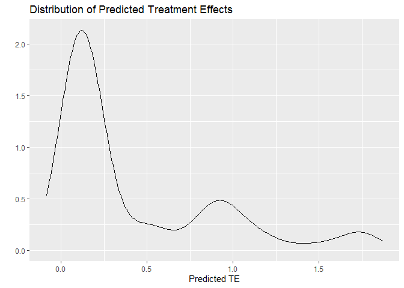

<!-- README.md is generated from README.Rmd. Please edit that file -->

# cfeval

<!-- badges: start -->

[](https://www.tidyverse.org/lifecycle/#experimental)
[](https://codecov.io/gh/ensley-nexant/cfeval?branch=master)
[](https://github.com/ensley-nexant/cfeval/actions)
<!-- badges: end -->

In the course of an analysis, many causal forest models may need to be
created, evaluated, and compared to one another. The `cfeval` package
aims to streamline that process by providing utility and plotting
functions to perform repetitive tasks common to all of these models.

`cfeval` requires the [`grf` package](https://github.com/grf-labs/grf)
to function, and is heavily dependent on its API.

## Installation

You can install the latest version of cfeval from
[Github](https://github.com/ensley-nexant/cfeval) with

``` r
devtools::install_github('ensley-nexant/cfeval')
```

or, if you have located the path to the source tarball, with

``` r
install.packages('E:\Path\To\Package\cfeval_x.x.x.tar.gz', repos = NULL, type = 'source')
```

## Usage

First create an example dataset and fit a causal forest.

``` r
library(cfeval)

n <- 2000; p <- 10

X <- matrix(rnorm(n * p), n, p)
W <- rbinom(n, 1, 0.4 + 0.2 * (X[, 1] > 0))
Y <- pmax(X[, 1], 0) * W + X[, 2] + pmin(X[, 3], 0) + rnorm(n)

cf <- grf::causal_forest(X, Y, W)
```

Next, create a causal forest evaluation object, passing the trained
forest and the original training dataset.

``` r
cfe <- cf_eval(cf, X)
```

The `cf_eval` object contains three elements:

1.  `dat`, the original training dataset;
2.  `res`, summarized results from out-of-bag training predictions;
3.  `varimp`, all covariates used in the forest along with their
    relative importances.

Note that the trained forest `cf`, which can be several gigabytes in
size even for moderately sized problems, is not copied or carried around
by `cf_eval`. This improves performance. For actual work, I recommend
compressing the forest and writing it to disk with `saveRDS()`, then
loading it for evaluation when required.

One of the many plotting convenience functions offered by `cfeval` is to
view the distribution of estimated conditional average treatment
effects.

``` r
plot(cfe, kind = 'cate')
```


