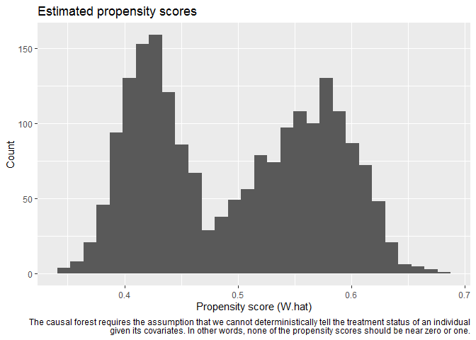

<!-- README.md is generated from README.Rmd. Please edit that file -->

# cfeval

<!-- badges: start -->

[](https://www.tidyverse.org/lifecycle/#experimental)
[](https://CRAN.R-project.org/package=cfeval)
[](https://codecov.io/gh/ensley-nexant/cfeval?branch=master)
[](https://github.com/ensley-nexant/cfeval/actions)
<!-- badges: end -->

In the course of an analysis, many causal forest models may need to be
created, evaluated, and compared to one another. The `cfeval` package
aims to streamline that process by providing utility and plotting
functions to perform repetitive tasks common to all of these models.

`cfeval` requires the [`grf` package](https://github.com/grf-labs/grf)
to function, and is heavily dependent on its API.

## Installation

You can install the released version of cfeval from
[Github](https://github.com/ensley-nexant/cfeval) with:

``` r
devtools::install_github('ensley-nexant/cfeval')
```

## Example

This is a basic example which shows you how to solve a common problem:

``` r
library(cfeval)

n <- 2000; p <- 10

X <- matrix(rnorm(n * p), n, p)
W <- rbinom(n, 1, 0.4 + 0.2 * (X[, 1] > 0))
Y <- pmax(X[, 1], 0) * W + X[, 2] + pmin(X[, 3], 0) + rnorm(n)
cf <- grf::causal_forest(X, Y, W)

plot_propensities(cf)
#> `stat_bin()` using `bins = 30`. Pick better value with `binwidth`.
```


